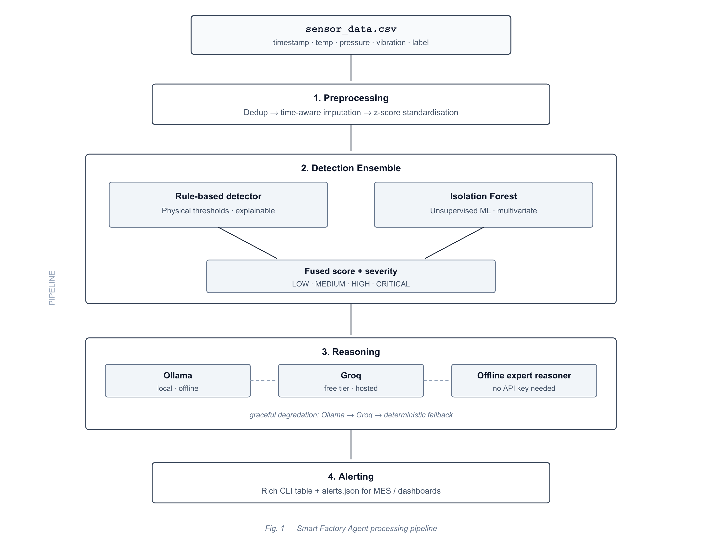
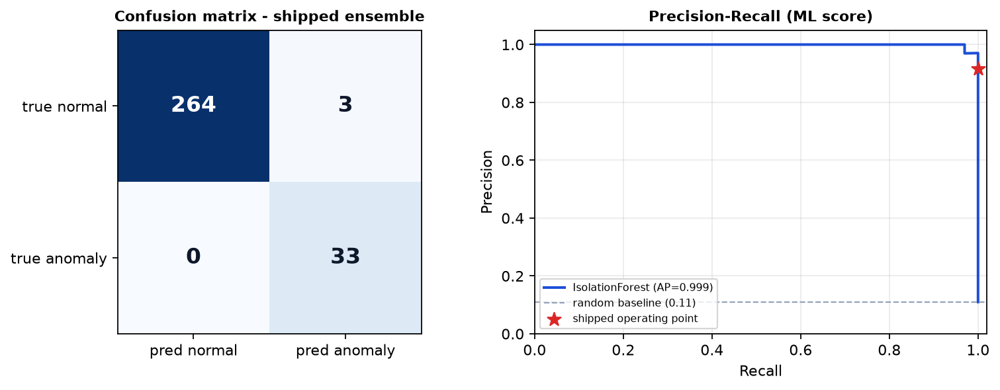

# Smart Factory Equipment Anomaly Alert Agent

An AI agent that monitors factory equipment sensor data (temperature, pressure,
vibration), detects anomalies using an ensemble of deterministic threshold rules
and an Isolation Forest, and emits prioritised, actionable alerts with
plain-language diagnoses.

The reasoning layer can call a local or hosted LLM, but the system runs **fully
offline with no API key** using a built-in deterministic maintenance knowledge
base. Detection itself is always deterministic and unit-tested — the LLM only
phrases the explanation.

> Built for the Pegatron ML Engineer assignment (Assignment 3), end to end with
> free AI tools. See [`docs/AI_LOG.md`](docs/AI_LOG.md) for the full development
> record.

---

## Quick start

```bash
pip install -r requirements.txt
python run_all.py
```

One command reproduces the entire submission: generates the dataset, runs the
agent, evaluates every detector configuration, renders the figures, and runs the
test suite. No API key, no network, no configuration.

<details>
<summary>Or run each step separately</summary>

```bash
python generate_data.py --rows 300 --seed 42 --out data/sensor_data.csv
python agent.py                      # detect + alert -> alerts.json
python agent.py --min-severity CRITICAL
python evaluate.py                   # metrics + PR curve + confusion matrix
pytest -q                            # 11 tests
```
</details>

---

## Architecture



| Stage | What happens |
|---|---|
| **1. Preprocessing** | De-duplicate timestamps, impute missing values (time-aware interpolation), produce a separate z-scored copy for the ML detector. Physical units are kept apart from scaled values so alerts stay human-readable. |
| **2. Detection ensemble** | A rule detector applies physical thresholds; an Isolation Forest (200 trees) learns the normal multivariate envelope unsupervised. Scores fuse as `max(rule, ML)` — an OR-of-evidence that favours recall. |
| **3. Reasoning** | Ollama → Groq → deterministic knowledge base, in priority order. Any failure degrades to the deterministic path without interrupting execution. |
| **4. Alerting** | Colour-coded severity table, top-priority alert card, and `alerts.json` for downstream MES or dashboard integration. |

---

## Results

| Detector configuration | Precision | Recall | F1 | F2 | Flagged |
|---|---|---|---|---|---|
| Rule-based only | 0.943 | 1.000 | 0.971 | 0.988 | 35 |
| Isolation Forest only | 0.917 | 1.000 | 0.957 | 0.982 | 36 |
| Gaussian Mixture (K = 2) | 0.917 | 1.000 | 0.957 | 0.982 | 36 |
| **Rule + IF ensemble (shipped)** | **0.917** | **1.000** | **0.957** | **0.982** | **36** |

300 readings · 33 true anomalies · **zero missed** · 11 unit tests passing.



F2 is reported alongside F1 because β=2 weights recall four times more than
precision — the right emphasis when a missed fault costs more than a false
alarm. Accuracy is deliberately omitted: with ~11% positives, predicting "all
normal" would already score ~89%.

**Precision is below 1.0 for a reason worth knowing.** Two rows had a missing
vibration reading positioned between two high-vibration neighbours.
Interpolation filled them with 0.080 and 0.088 — above the 0.07 threshold. Those
rows are labelled normal in the source data but breach *after* cleaning, so they
count as false positives. The detectors behaved correctly; the value they were
given never occurred. Cleaning is not a neutral step. See §6 of the technical
report.

---

## Features

- **Rule + ML ensemble** — threshold rules catch known failure modes with zero
  training data; Isolation Forest catches multivariate patterns no single
  threshold expresses. Either detector alone can raise an alarm.
- **Severity scoring** — every alert scored 0–1 and classified LOW / MEDIUM /
  HIGH / CRITICAL from breach count and anomaly score.
- **LLM-augmented reasoning** — optional Ollama (local) or Groq (free tier)
  turns detections into diagnoses and recommended actions.
- **Deterministic fallback** — a maintenance knowledge base keyed on
  `(signal, direction)` provides concrete guidance when no LLM is reachable.
- **Preprocessing with a cleaning report** — duplicate removal, imputation,
  z-score standardisation, all counted and logged.
- **Evaluation harness** — precision, recall, F1, F2, confusion matrix and
  precision–recall curve against ground-truth labels.
- **Reproducible synthetic data** — seeded generator (~11% anomaly rate) with
  deliberately injected missing values and duplicate timestamps, plus a
  generator-side assertion guaranteeing every abnormal row breaches a threshold.
- **One-command reproduction** — `run_all.py` regenerates every artifact.

---

## Requirements

Python 3.10+.

```bash
pip install -r requirements.txt
```

Key dependencies: `pandas`, `scikit-learn`, `numpy`, `matplotlib`, `rich`,
`pytest`.

---

## CLI reference

### `agent.py`

| Flag | Type | Default | Description |
|------|------|---------|-------------|
| `--data` | path | `data/sensor_data.csv` | Path to sensor data CSV |
| `--backend` | choice | auto-detect | Force a reasoning backend (`ollama`, `groq`, `offline`) |
| `--min-severity` | choice | `LOW` | Minimum severity to display (`LOW`, `MEDIUM`, `HIGH`, `CRITICAL`) |
| `--json` | path | `alerts.json` | Output JSON file for alerts |

### `generate_data.py`

| Flag | Type | Default | Description |
|------|------|---------|-------------|
| `--rows` | int | `300` | Number of sensor readings to generate |
| `--seed` | int | `42` | Random seed for reproducibility |
| `--out` | path | `data/sensor_data.csv` | Output CSV path |

---

## Enabling a real LLM backend

Backends are auto-detected in priority order: **Ollama → Groq → offline**.
Override with `--backend`.

### Ollama (local, offline, free)

```bash
ollama serve              # start the daemon
ollama pull llama3.2      # ~2 GB, one time
python agent.py           # auto-detects on localhost:11434
```

Local inference matters for a factory context: plant networks are frequently
air-gapped, and sensor data may not be permitted to leave site.

### Groq (free tier, hosted)

```bash
export GROQ_API_KEY="gsk_..."     # Windows: $env:GROQ_API_KEY = "gsk_..."
python agent.py
```

> **Neither backend is required.** With no LLM reachable, the agent uses a
> deterministic expert reasoner that maps each breach type to a concrete
> diagnosis and recommended action. No API key, no internet, no GPU.

**A measured caveat.** Running the same 36 detections through llama3.2 and the
deterministic knowledge base surfaced three failure modes in the model output:
it addressed only one signal on rows breaching several thresholds, occasionally
inverted the fault direction ("increase operating temperature" for an
under-temperature breach), and referenced hardware that does not exist. The
knowledge base did none of these, because its guidance is retrieved against
detected faults rather than generated. This is why the LLM never influences
detection.

---

## Project layout

```
smart-factory-agent/
├── run_all.py           # ONE COMMAND -> reproduces the whole submission
├── agent.py             # CLI entry point, orchestrates the pipeline
├── generate_data.py     # Synthetic sensor data generator with injected faults
├── preprocessing.py     # Cleaning, imputation, z-score standardisation
├── detectors.py         # Rule detector, Isolation Forest, ensemble, severity
├── llm_backend.py       # Ollama / Groq / offline reasoner + knowledge base
├── evaluate.py          # Metrics, confusion matrix, precision-recall curve
├── test_agent.py        # Pytest suite (11 tests)
├── check_data.py        # Dataset invariant checks
├── requirements.txt
├── Technical_Report_Assignment_3_Vaibhav.pdf
├── Presentation_Assignment_3_Vaibhav.pdf
├── data/
│   └── sensor_data.csv  # Generated dataset (committed for reproducibility)
├── assets/
│   ├── architecture.png
│   └── evaluation.png
└── docs/
    ├── AI_LOG.md            # Every AI interaction and what was verified
    └── aider_transcript.md  # Complete agentic coding session transcript
```

---

## Documentation

| Document | Contents |
|---|---|
| [Technical Report](Technical_Report_Assignment_3_Vaibhav.pdf) | Methodology, architecture, evaluation, findings, limitations |
| [Presentation](Presentation_Assignment_3_Vaibhav.pdf) | 17-slide deck covering the full project |
| [`docs/AI_LOG.md`](docs/AI_LOG.md) | Every AI interaction with the command run to verify it |
| [`docs/aider_transcript.md`](docs/aider_transcript.md) | Complete unedited agentic session transcript, including failed edits |

---

## How this was built

Development used an agentic coding loop: **Aider** driving a free-tier frontier
model, reading the repository, planning changes, writing files and committing to
git. Manual effort was limited to specifying constraints, verifying every output
by execution, and taking over where the agent stalled.

Every AI-generated module was executed and its output inspected rather than
reviewed by reading alone. That process identified five defects, none of which
were apparent from the source code — including an LLM backend that reported
`backend: ollama` and returned plausible output while every call was silently
failing, because requests went to the wrong endpoint and a bare `except: pass`
suppressed the exceptions.

That defect motivated a principle applied throughout: **status output must
report observed state, never intended state.**

Full record in [`docs/AI_LOG.md`](docs/AI_LOG.md).

---

## Known limitations

- **Point anomalies only.** Each reading is scored independently, so gradual
  drift across a window is not detected. That needs a windowed or sequence
  model.
- **A sequence model was deliberately not attempted.** The dataset consists of
  independently sampled point anomalies with no temporal correlation — an LSTM
  would have no learnable temporal structure.
- **Imputation is non-causal.** Interpolation uses the reading *following* the
  gap, which is unavailable in a streaming context. Production would use causal
  forward-fill.
- **Severity thresholds are heuristic.** The boundaries were chosen to produce a
  usable distribution, not derived from a cost model.

## Next steps

Kafka ingestion in place of CSV · per-machine learned thresholds · drift
detection with scheduled retraining · an operator confirm/dismiss feedback loop
to accumulate genuine fault labels · retrieval-grounded maintenance
recommendations · MES integration so a CRITICAL alert raises a work order
automatically.

---

**Vaibhav Kumar Sunkaria** · Pegatron ML Engineer Assignment 3